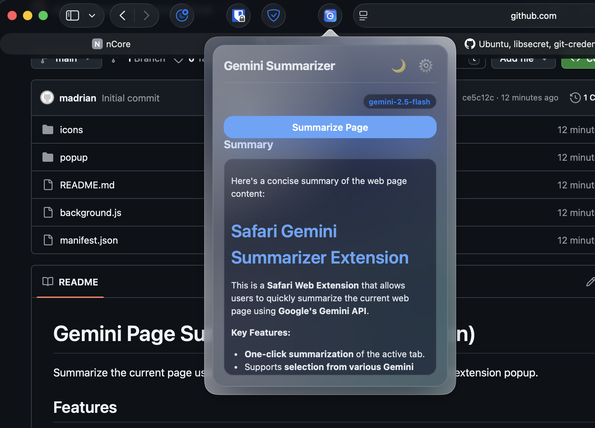

# Gemini Page Summarizer (Safari Extension)

Summarize the current page using Google's Gemini API with a clean, glassy Safari extension popup.

## Features
- Summarize the active tab with one click.
- Choose from available Gemini models.
- Store API key and model selection locally.
- Glass-inspired UI with light/dark toggle.

## Screenshot

## Requirements
- macOS with Safari.
- Xcode (for building the Safari Web Extension app).
- A Gemini API key.

## Setup (Safari Web Extension)
1. Open the Xcode project generated for the Safari Web Extension.
2. Select the app target in the scheme selector.
3. Product > Run.
4. In Safari: Settings > Extensions, enable the extension.
5. Click the toolbar icon to open the popup.
6. Paste your Gemini API key and save.

## Development Notes
- Popup UI: `popup/index.html`, `popup/style.css`, `popup/popup.js`
- Background worker: `background.js`
- Extension manifest: `manifest.json`

## Permissions
- `activeTab`, `scripting`: read the current page text.
- `storage`: save API key and preferences.
- `https://generativelanguage.googleapis.com/*`: Gemini API calls.

## License
MIT
